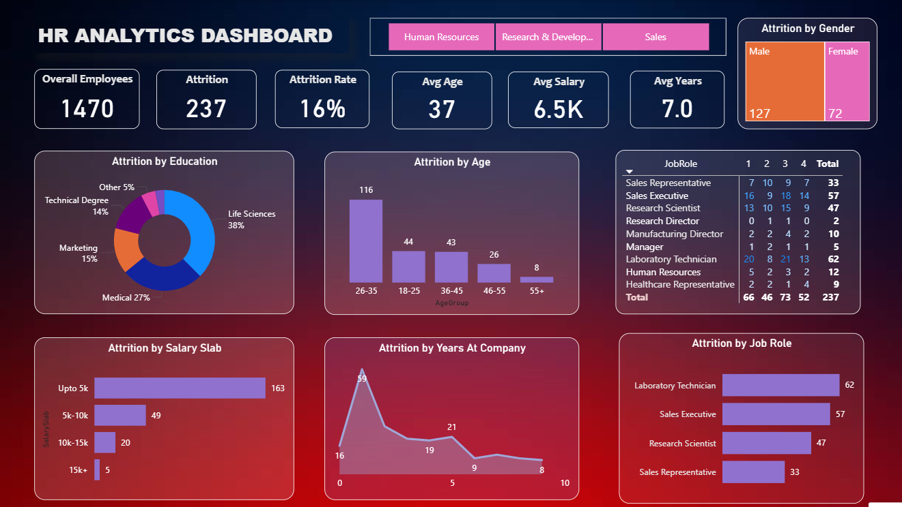

An interactive HR Analytics Dashboard built using Microsoft Power BI to analyze employee data, attrition, compensation, departments, and workforce trends.

Project Overview

This project focuses on analyzing employee data and identifying patterns related to employee attrition and workforce performance.

## Key KPIs

- Total Employees
- Total Attrition
- Attrition Rate
- Average Compensation
- Average Length of Service

## Analysis

- Department-wise Employee Analysis
- Attrition Analysis
- Employee Trends
- Compensation Analysis
- Length of Service Analysis

## Tools Used

- Microsoft Power BI
- Power Query
- DAX
- Data Modeling
- Microsoft Excel

## Skills Demonstrated

- Data Cleaning and Transformation
- Data Modeling
- DAX Measures
- Data Visualization
- KPI Development
- Interactive Dashboard Design
- Business Analysis

## Dashboard Preview

## Live Dashboard

[View Interactive Power BI Dashboard](https://app.powerbi.com/view?r=eyJrIjoiMTJkMDczYzctYjJjZS00NjM5LWI0M2MtYzhmM2YwMzhmMzFmIiwidCI6IjFiNmEzMDYyLWI5MDktNDUwZS04NzRhLTRiMTc4YWJkM2U5NSJ9&pageName=c0fb446f2dc07bb86e1a)
